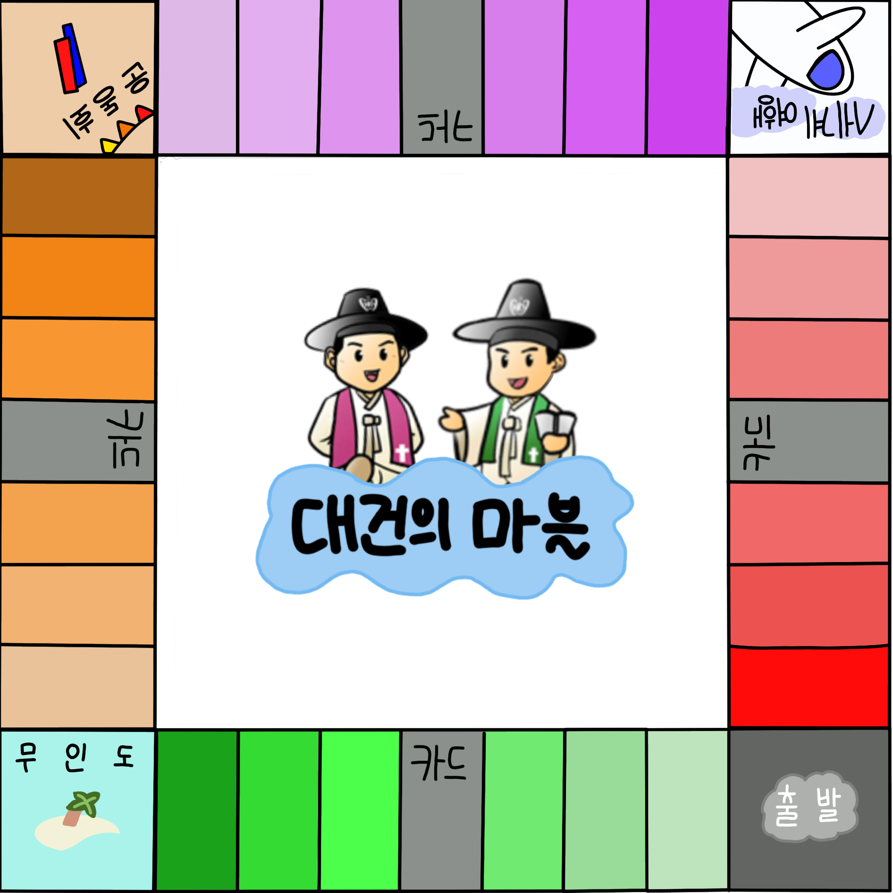

# 대건의 마블 

  
소켓 통신을 활용한 대건고등학교 보드게임

## Server
소켓 통신 서버 (책임자 : [@이도원](https://github.com/II-DW))

### Stack

- [X] Socket Communication - Python Socket module
- [X] Game Structure - Python Pygame module

### Feature

- 멀티 쓰레딩을 활용해 Socket Server 및 게임 동시 구동
- Socket Server을 이용해 Client의 메세지를 받아와 이벤트 처리

### Foloder Structure
- Image : Image 모음
- src : Source 모음

## Client
소켓 통신 클라이언트 (책임자 : [@이도원](https://github.com/II-DW))

### Stack

- [X] Socket Communication - Python Socket module
- [X] Game Structure - Python Pygame module

### Feature

- 플레이어가 특정 행동을 실행했을 때 서버에게 메세지 보내기

### Foloder Structure

## Referecne

[멀티 서바이벌게임 만들기 Python #1 - Mawile(2020.11.14)](https://mawile.tistory.com/64)
